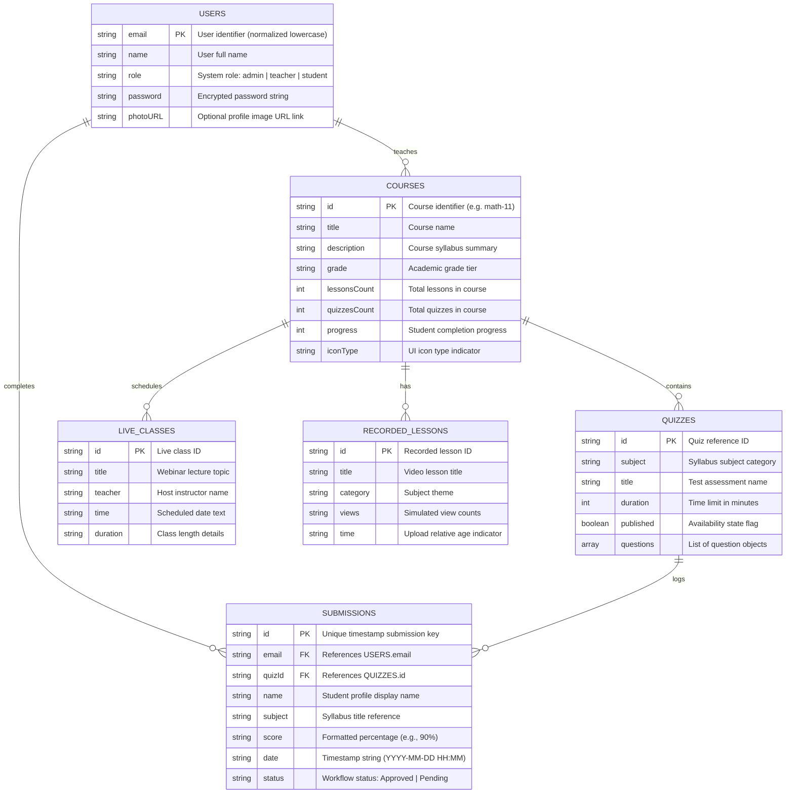
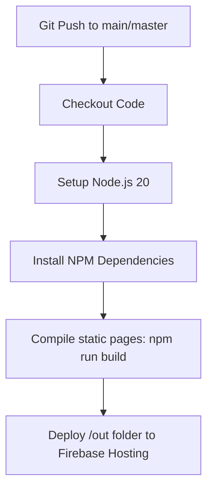

# MasterLearning LMS - Interactive E-Learning & Cloud Sandbox Platform

Welcome to MasterLearning! This is a premium, cloud-native Learning Management System (LMS) designed to deliver a modern, fluid, and highly scalable educational experience.

MasterLearning features a stunning, state-of-the-art liquid glassmorphism user interface (built on Next.js) and operates a fully decoupled, serverless backend architecture utilizing Google Cloud Firebase services. It is engineered from the ground up to demonstrate cloud elasticity, virtualized hosting, distributed database patterns, and robust CI/CD automation pipelines.

---

## 1. What is MasterLearning? (The Big Picture)

Educational websites suffer from extreme traffic volatility. During normal school weeks, usage is low; but during exams, registrations, or assignment deadlines, traffic spikes by thousands of users instantly.

MasterLearning solves this by deploying as a JAMstack application:
* **Static Serving**: The Next.js frontend compiles entirely to static assets served globally from CDN edge nodes via Firebase Hosting. This guarantees sub-second page loads with zero runtime server costs.
* **Serverless Scale**: Database queries and user actions are handled on-demand by serverless API collections, automatically scaling internal resource threads from zero to thousands of parallel transactions.
* **Dual-Engine Offline Fallback**: To prevent lockouts during network drops or API limits, our custom database wrapper (`src/lib/db.ts`) runs a smart cache-aside sync pipeline. If Firestore is offline, records are written locally in the browser's `localStorage` and dynamically merged back when access is restored.

---

## 2. Project Directory Structure

Here is a guide to the files and directories in this repository:

* **src/**: Main application source code.
  * **app/**: Next.js App Router pages (login, dashboard, quiz attempts, registry lists, profiles).
  * **components/**: Reusable React interface blocks (CookieConsent, StatsCards, QuizTimer).
  * **lib/**: Database connections and transaction wrappers (db.ts, firebase.ts).
  * **data/**: Base mock quiz structures (quizzes.ts).
* **scripts/**: Node database seeder utilities (seed.js).
* **.github/workflows/**: CI/CD automation configurations (main.yml).
* **report.tex**: Complete academic group project documentation.
* **Dockerfile**: Configuration for Nginx container execution.
* **firebase.json**: Web frameworks routing configurations for Firebase Hosting.

---

## 3. User Roles & Workspace Personas

MasterLearning tailors views dynamically depending on who logs in:

1. Student Workspace
   * **Dashboard**: Displays live statistical aggregates (quizzes completed, average scores) compiled dynamically from database submissions.
   * **Course Catalogue**: Browsable syllabus list. Clicking cards opens detailed topic modals, download links for worksheets, and lesson entryways.
   * **Assessment Taker**: Timed quiz module with active countdown timers and answers verification.
   * **Webinar Lounge**: Live webinar emulator with active group chat feeds.

2. Teacher Workspace
   * **Interactive Quiz Creator**: Lets teachers design new assessments, set correct options indices, and publish them instantly.
   * **Submissions Audit Table**: Clean list showing student quiz submissions, test dates, and scores with email receipt actions.
   * **Media Manager**: Allows teachers to upload recorded lecture streams or PDF handouts.

3. Administrator Workspace
   * **User Registry Directory**: A dashboard showing all registered accounts. Admins can inline edit names, roles, or delete users instantly.
   * **Database Seeding Tool**: A recovery utility that initializes default courses, quizzes, and simulated scores with one click.

---

## 4. Database Entity Relationship (ER) Diagram

The system operates across six primary Firestore collections. The relationships, primary/foreign keys, and data scopes are defined below:



---

## 5. Local Installation & Setup Guide

### 5.1 Prerequisites
Ensure you have Node.js v20+ and Git installed on your machine.

### 5.2 Installation Steps

1. **Clone the Repository**:
   ```bash
   git clone https://github.com/your-repo/MasterLearning.git
   cd MasterLearning
   ```

2. **Configure Environment Keys**:
   Copy the sample environment template file:
   ```bash
   cp .env.sample .env.local
   ```
   Open `.env.local` and paste your Firebase Web App configuration API keys.

3. **Install Dependencies**:
   ```bash
   npm install
   ```

4. **Initialize & Seed the Database**:
   Populate Firestore collections with baseline courses, quizzes, and test users:
   ```bash
   node --env-file=.env.local scripts/seed.js
   ```

5. **Start Dev Server**:
   ```bash
   npm run dev
   ```
   Open your browser and navigate to `http://localhost:3000` to interact with the platform.

6. **Build for Production**:
   Compile Next.js into static static assets:
   ```bash
   npm run build
   ```
   The compiled assets will be placed in the `/out` directory.

---

## 6. Automated CI/CD Deployment Workflow

Every push to the main or master branch triggers our GitHub Actions pipeline (`.github/workflows/main.yml`) to automatically compile and deploy the application:



### Setting up CI/CD Secrets:
1. Generate a Service Account JSON key from your GCP Credentials portal.
2. In your GitHub Repository settings, navigate to *Secrets and Variables -> Actions*.
3. Add a secret named `FIREBASE_SERVICE_ACCOUNT_MASTERLEARNING_224BD` and paste the entire JSON key payload.
4. Add secrets matching your `.env.local` variables (`NEXT_PUBLIC_FIREBASE_API_KEY`, etc.) so the automated build runner can pre-render static queries successfully.

---

## 7. Docker Virtualization

You can run the entire static application in a lightweight container using our multi-stage `Dockerfile`:

```bash
# Build the container image
docker build -t masterlearning .

# Start Nginx server container on local port 80
docker run -p 80:80 masterlearning
```

---

## 8. Default Login Credentials

Use these seeded test accounts to sign in and test the different roles on the platform:

| Role | Email | Password |
|---|---|---|
| **Administrator** | `admin@masterlearning.com` | `password123` |
| **Teacher** | `teacher@masterlearning.com` | `password123` |
| **Student** | `student@masterlearning.com` | `password123` |
