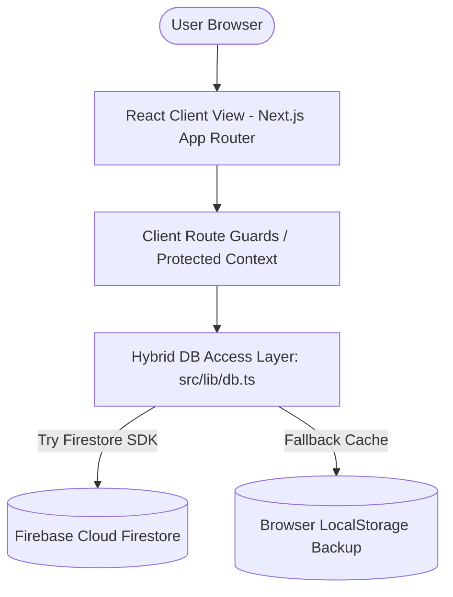
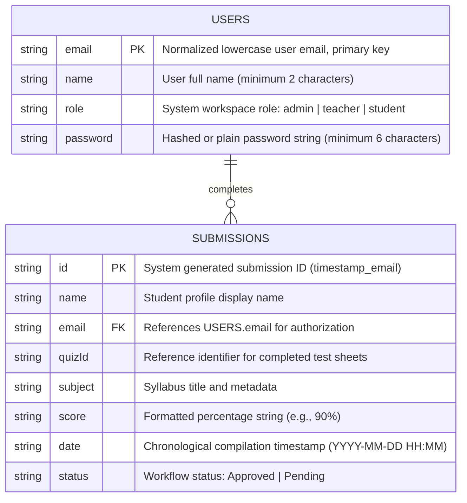
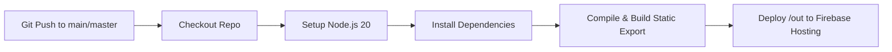

# MasterLearning LMS — Software Requirements Specification (SRS) & Architecture

MasterLearning is a premium Learning Management System (LMS) engineered with a liquid glassmorphic layout, fluid client animations, and a dynamic hybrid storage database architecture. This document serves as the formal Software Requirements Specification (SRS) and Technical Design guide.

---

## 1. Executive Summary & Purpose

### 1.1 Purpose
This document specifies the software requirements, system design, architectural flowcharts, and relational models for the MasterLearning e-learning platform. It is designed to act as the single source of truth for engineering development, security auditing, and deployment instructions.

### 1.2 Scope
MasterLearning coordinates e-learning workflows under a unified platform:
* **Academic Dashboards**: Context-rich progress screens customized for three client roles: Students, Teachers, and Administrators.
* **Assessment Engine**: Responsive interactive quizzes featuring question timers, answer validation, and historical result logging.
* **Registry Directory**: User management workflows with inline creations, audits, edits, and role modifications.
* **Virtual Classroom**: Live streaming webinar simulator with active student chat lobby feeds.

---

## 2. System Architecture

MasterLearning is built as a highly responsive client-side web application leveraging Next.js React patterns. The core architecture uses a decoupling design to isolate storage, interface components, and routing guards.



### 2.1 Hybrid Storage Architecture
To ensure continuous operation under weak network conditions or credential failures, the database abstraction wrapper (`src/lib/db.ts`) operates a **dual-engine cache-aside structure**:
1. **Primary Database (Firestore)**: Writes and queries are sent asynchronously to Firestore collections using web client SDK handlers.
2. **Fallback Cache (localStorage)**: If a transaction fails (e.g., net offline or firestore permission error), the wrapper intercepts the exception, logs a console warning, and replicates the record inside local storage JSON tables. Subsequent reads dynamically merge firestore docs and local buffers.

---

## 3. Database Entity Relationship (ER) Diagram

The system maps data objects across two collections (`users` and `submissions`). The database schema, fields, types, and constraints are defined below:



---

## 4. Functional Specification

### 4.1 Role-Based User Workspaces

#### 4.1.1 Student Workspace
* **Welcome Banner**: Displays dynamic calculated student stats: *Quizzes Finished* and *Average Grade* compiled in real-time from matching database submission records.
* **Classroom Tasks Sidebar**: Clickable indicator shortcuts pointing to `/quiz` and `/classroom` views.
* **Profile Summary Card**: Reads the local storage session to display correct student names and compute two-character initials (e.g., `KA` for `Kavishka Aswaththa`).
* **Syllabus Viewer**: Clicking any subject card opens a modal overlay showing topics progress, lessons remaining, and launch pathways to live lectures, recaps, and test papers.

#### 4.1.2 Teacher Workspace
* **Metrics Board**: Summarizes active classrooms count, student registrations, and quiz evaluations.
* **Assessment Records Table**: Provides search, status filtering, and sorting parameters. Offers a quick action dropdown to copy grade details, send email receipts, or audit answer sheets.
* **Creator Panel**: Interactive module enabling teachers to compile and publish new quiz questionnaires or upload lecture recordings.

#### 4.1.3 Administrator Workspace
* **Registry Directory**: Master list showing all students and teachers.
* **User Control Options**: Quick actions to copy registry emails, run credentials validation checks, edit full names/roles, or delete users.
* **Database Backup Utility**: Simulated system backup triggers and CSV logs exporter.

---

## 5. Security & Validation Parameters

### 5.1 Route Guards
The authentication layout includes client-side router guards:
* Accessing `/dashboard`, `/users`, `/profile`, `/quiz`, `/classroom`, or `/settings` requires a valid authenticated user object stored in `localStorage` (`user`).
* Unauthorized guest visits are redirected back to `/login` with an `auth_required` error parameter, which prompts a warning toast.
* Role-specific screens (e.g., `/users` registry list) restrict access to `admin` accounts; non-admin users are automatically sent back to the main `/dashboard`.

### 5.2 Input Valdation Logic
To prevent corrupt data entries or statistical calculations failures, strict validation filters apply on all form handlers:
* **Email Address**: Validated for structural correctness (presence of `@` and `.` characters).
* **Full Name**: Checked for a minimum length of 2 characters.
* **Password**: Regulated to require at least 6 characters.
* **Quiz Title / Class Name**: Required to contain at least 3 characters.
* **Quiz Scores**: Parsed dynamically through a robust converter that extracts integer values from fraction strings (`"8/10"` -> `80%`) or percentage strings (`"90%"` -> `90%`), protecting dashboard average calculations.

---

## 6. Installation & Operational Guide

### 6.1 Local Development Setup

1. **Setup Credentials**: Duplicate the sample environment configurations template into a local file:
   ```bash
   cp .env.sample .env.local
   ```
   Fill in your Firebase web app keys in the `.env.local` file.

2. **Install Dependencies**:
   ```bash
   npm install
   ```

3. **Run Database Seeder**: To initialize user accounts, templates, and submission statistics in Firestore, run:
   ```bash
   node --env-file=.env.local scripts/seed.js
   ```

4. **Start Development Server**:
   ```bash
   npm run dev
   ```

5. **Static Site Build**: To compile and export the application into a static `/out` folder locally:
   ```bash
   npm run build
   ```

---

## 7. CI/CD Deployment Pipeline (GitHub Actions & Firebase Hosting)

MasterLearning includes a fully automated deployment pipeline defined in `.github/workflows/main.yml`. Whenever code is pushed to the `main` or `master` branch, GitHub Actions executes the following pipeline:



### 7.1 Setup Pipeline Credentials
To enable GitHub Actions to deploy to your live Firebase environment:
1. **Firebase Service Account JSON**: Generate a private key credential JSON from your [Google Cloud Console Credentials Page](https://console.cloud.google.com/apis/credentials) for the Firebase Service Account.
2. **GitHub Secrets**:
   * Add `FIREBASE_SERVICE_ACCOUNT_MASTERLEARNING_224BD` to your repository Secrets and paste the content of the downloaded JSON key file.
   * Add secrets for each of your Firebase environment variables (`NEXT_PUBLIC_FIREBASE_API_KEY`, etc.) matching the keys in `.env.local`. This allows the GitHub runner to compile static pages with active database connections.

### 7.2 Docker Virtualization
The project includes a multi-stage `Dockerfile` configured to compile the application and serve the static assets using an Nginx container. To build and run the container locally:
```bash
docker build -t masterlearning .
docker run -p 80:80 masterlearning
```

---

## 8. Default Seed Credentials

Use these seeded test accounts to sign in to the platform:

| Role | Email | Password |
|---|---|---|
| **Administrator** | `admin@masterlearning.com` | `password123` |
| **Teacher** | `teacher@masterlearning.com` | `password123` |
| **Student** | `student@masterlearning.com` | `password123` |
